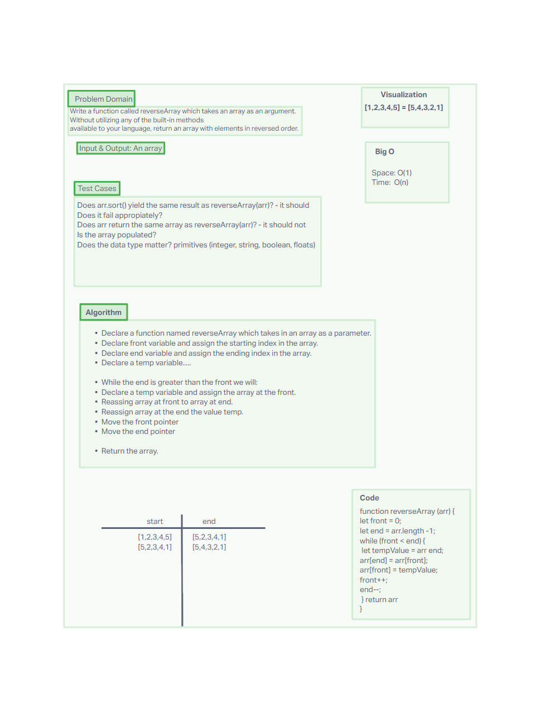

# Code Challenge 01 - Reverse Array

## Objective

Write a function called reverseArray which takes an array as an argument. Without utilizing any of the built-in methods available to your language, return an array with elements in reversed order.

## Whiteboard

## Approach & Efficiency

- Used inVision to visualize the problem domain.
