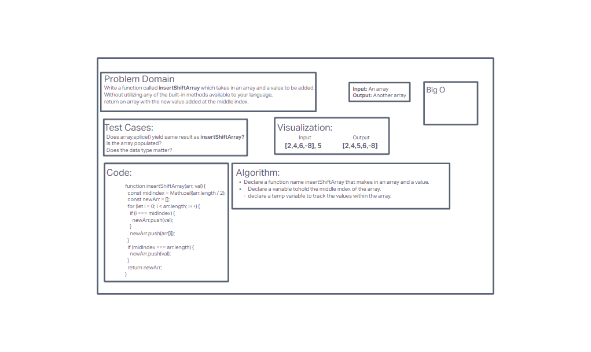

# Code Challenge 02 - insertShiftArray

## Objective

Write a function called `insertShiftArray` which takes in an array and a value to be added. Without utilizing any of the built-in methods available to your language, return an array with the new value added at the middle index.

## Whiteboard

## Approach & Efficiency

After using Google to get some clarity. Used replit to play around with arrays. Still not sure what "Big O" is entirely. 
